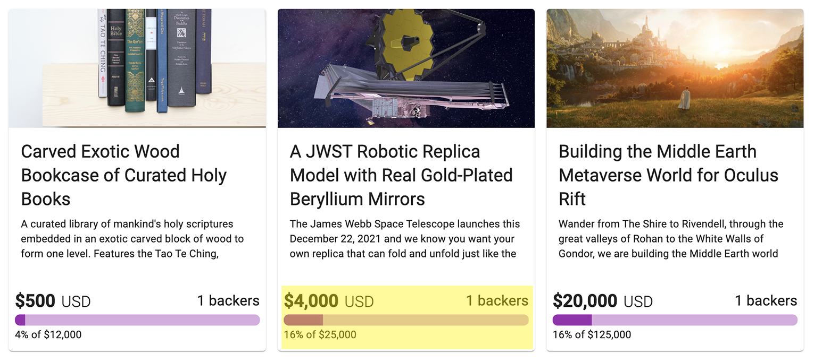
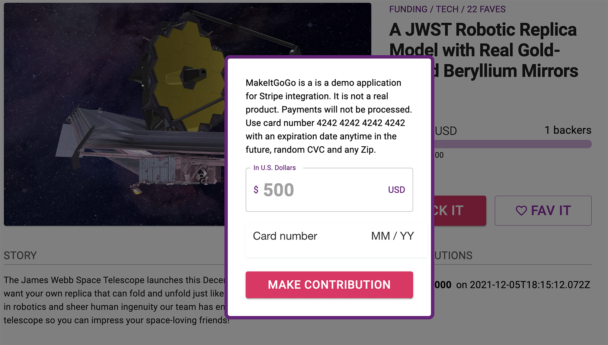
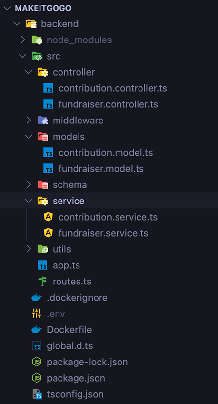
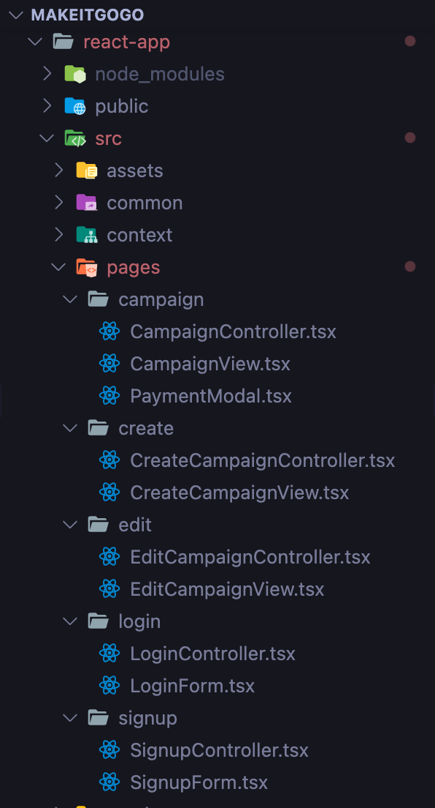

[](https://makeitgogo.davidquintero.dev)

## Overview

MakeItGoGo is a crowdfunding full-stack application made with React.js and Express.js integrating the Firebase API for user authentication and the Stripe API for payment processing. As an unregistered user you are able to view campaigns and contribute (BACK IT) with a test credit card number. You are also able to show your appreciation and support for a particular campaign by giving it unlimited Faves.

As a registered user, you are able to create a campaign providing the required campaign title and story, upload an image for display in the campaign card and page, choose a category and stablish a US dollar goal amount.

Each campaign receives funds individually, for which reason a dedicated account is created on Stripe at the moment of submission. The browser receives a redirect URL through the headers leading to the Stripe Connect onboarding and verification flow. This is where a campaing owner would provide banking and ID verification to received funds collected by MakeItGoGo. Because this is a test environment, Stripe provides way to enter dummy information for such thing as routing and account numbers. Once the onboarding is completed, Stripe redirects the user to the newly created campaign URL on MakeItGoGo. The campaign is now able to accept credit card payments.

The campaign owner would see an EDIT link which would allow them to modify all campaign data originally provided upon creation, even the goal amount. All form fields are pre-filled with the existing data to facilitate in things like typo corrections, etc. On this same page, a campaign owner is able to DELETE the campaign.

## Installation

### Express server

This project consists of a React app and an Express server. We will start with the Express server. Navigate to the `backend` directory and create a `.env` file with the following variables:

```
PORT=
DB_URI=
STRIPE_SECRET_KEY=
REACT_APP_URL=
COMPANY_NAME=
```

Here you must provide the PORT number, a MongoDB URI string, the Stripe API Secret Key, the HTTP URL of the React app (and port number if in development environment), and the app name as COMPANY_NAME.

Now run the following command from your CLI:

`yarn install`

This will install all project dependencies. Then:

`yarn dev`

This will start the server on the `PORT` provided in the `.env` file.

### Expected payload

Making a `GET` request to the `/api/fundraiser` endpoint should return an array of campaign objects similarly structured with a `200` response code:

```
[
  {
  "_id":"61ac706c947d3bc22c43a869",
  "title":"Carved Exotic Wood Bookcase of Curated Holy Books",
  "story":"A curated library of mankind's holy scriptures embedded in an exotic carved block of wood to form one level. Features the Tao Te Ching, Analects of Confucius, The Torah, The Discourses of the Buddha, The Qu'ran, The Bible and The Bhagavad Gita.\n\n",
  "image_url":"https://res.cloudinary.com/dgt2j8jc0/image/upload/v1638690898/MakeItGoGo/oyuewczf75la5wqexycv.png",
  "category":"Education",
  "goal_amount":12000,
  "current_amount":500,
  "published":true,
  "owner":"pTJcUxNYUcYXKzfUm7EzVAaqv7t1",
  "email":"makeit@davidquintero.dev",
  "stripeId":"acct_1K3FZ8QtwaCQBlju",
  "faves":4,
  "date":"2021-12-05T07:55:24.221Z",
  "contributions":[
      {
          "amount":500,
          "fundraiserId":"61ac706c947d3bc22c43a869",
          "date":"2021-12-05T18:11:56.966Z",
          "_id":"61ad00ecc213671e258be6f7",
          "__v":0
      }],
   "__v":1
   },]
```

### React App

Navigate to the `react-app` directory and create a `.env` file with the following variables:

```
REACT_APP_FIREBASE_API_KEY=
REACT_APP_FIREBASE_AUTH_DOMAIN=
REACT_APP_FIREBASE_PROJECT_ID=
REACT_APP_FIREBASE_STORAGE_BUCKET=
REACT_APP_FIREBASE_MESSAGING_SENDER_ID=
REACT_APP_FIREBASE_APP_ID=
REACT_APP_CLOUDINARY_UPLOAD_URL=
REACT_APP_CLOUDINARY_CLOUD_NAME=
REACT_APP_CLOUDINARY_UPLOAD_PRESET=
REACT_APP_STRIPE_PUBLISHABLE_KEY=
REACT_APP_API_URL=
```

These values will come from your Firebase API credentials, Cloudinary (for image upload storage), Stripe Publishable Key, and a reference to the Express server API endpoint (and port number if in development environment) eg: `http://localhost:5000/api`

Now run the following command from your CLI:

`npm install`

This will install all project dependencies. Then:

`npm run start`

This will start the app on `PORT 3000`.

## Design Choices

### Front page

Following the theme of crowdfunding apps, MakeItGoGo makes use of the Card presentation for each campaign on the front page showing on each of these the current progress of its campaign.

The `Progress` component (highlighted) found in `/src/common/progress.tsx` was a key reusable component also used in the campaign pages.



### Campaign page

On the campaign page we see a clean look with plenty of white space balancing the elements. Notice the appearance of the `Progress` reusable component. We use a fuchsia accent color to highlight the main call to action to back a project with the BACK IT button.


A small modal opens upon click where the user can enter a contribution amount and test credit card.



Upon campaign contribution the progress bar advances and a record appears under the `CONTRIBUTIONS` section.

## Architectural Overview

### Data relationship

The data relationship was structured as follows:

A `Fundraiser` collection would store all data attributes of a Campaign document. Each time a `Contribution` was made it would be embedded as a subdocument in the `contributions` array of `Fundraiser`. This way a Campaign document always keep a record of every action performed.

### Model-View-Controller

The API endpoint requests go through the following path: `Request > Route > Controller > Service > Model > Schema`.

As seen in the folder structure below, this MVC patterns allows for the separation of concerns and a cleaner implementation of the API. The `Route` calls a function handler from the `Controller` which forwards the request to a `Service` function where the database is queried. This in turn passed to the Mongoose `Model` and data structure validation is performed by the `Schema`.



### Frontend

On the frontend we follow the same pattern within the organizational structure of React conventions. Under the `pages` directory we organize the components under their matching route names following the convention `Controller > View` to separate concerns between business logic and presentation.



## Conclusion

It has been an extremely rewarding experience having the privilege of working on this project. The amount of learning was nothing less than astounding and very challenging at times. Thank you for taking the time to review my project and notes.
